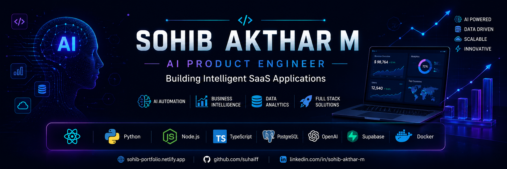
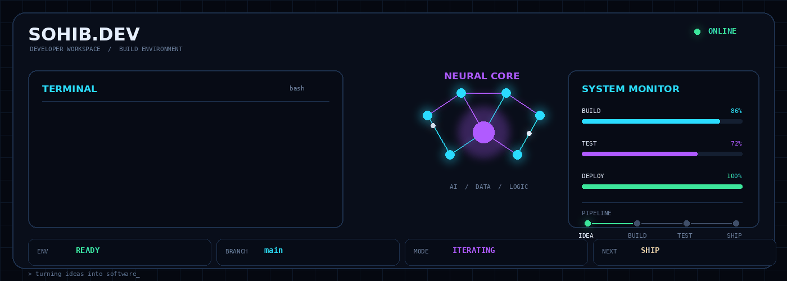

<h2 align="center">Welcome to my workspace.</h2>

  <code>initializing...</code>

 

  Ideas → Experiments → Products

  This is where I build, break, rethink, 
  and occasionally turn an idea into something real.

 

  <code>explore freely.</code>

---

<h2 align="center">Behind the Code</h2>

  <code>there's always another thing worth building.</code>

 

  I like taking an idea that exists only in my head 
  and turning it into something that actually works.

 

  <code>idea</code>
  → 
  <code>prototype</code>
  → 
  <code>problem</code>
  → 
  <code>solution</code>
  → 
  <code>product</code>

 

  <i>
  The fun part isn't writing the code. 
  It's figuring out what should be built in the first place.
  </i>

---

<h2 align="center">Build Log</h2>

  <code>~/sohib/projects</code>

 

<table align="center">

<tr>
<td width="50%" valign="top">

<h3>01 — Think</h3>

Find an interesting problem.

</td>

<td width="50%" valign="top">

<h3>02 — Build</h3>

Turn the idea into something real.

</td>
</tr>

<tr>
<td width="50%" valign="top">

<h3>03 — Break</h3>

Find what doesn't work.
Fix it. Repeat.

</td>

<td width="50%" valign="top">

<h3>04 — Ship</h3>

Put it in the hands of real people.

</td>
</tr>

</table>

 

  <code>git commit -m "make it better"</code>

---

<h2 align="center">Technology Ecosystem</h2>

Building scalable AI-powered web applications with modern technologies.

<table align="center">
<tr>

<td align="center" width="50%">

### Frontend

</td>

<td align="center" width="50%">

### Backend & AI

 

</td>

</tr>

<tr>

<td align="center">

### Database & Cloud

</td>

<td align="center">

### Development Tools

</td>

</tr>
</table>

<h4 align="center">Graphics & Visualization</h4>

---

<h2 align="center">Core Expertise</h2>

Delivering AI-driven products, intelligent business solutions, and scalable software architectures.

<table align="center">
<tr>

<td width="33%" align="center">

<h3>Artificial Intelligence</h3>

AI Integration 
Prompt Engineering 
Workflow Automation 
Intelligent Assistants

</td>

<td width="33%" align="center">

<h3>Business Intelligence</h3>

Dashboard Development 
Data Visualization 
KPI Reporting 
Decision Support

</td>

<td width="33%" align="center">

<h3>Data Engineering</h3>

Data Integration 
ETL Pipelines 
Data Validation 
Reporting Systems

</td>

</tr>

<tr>

<td width="33%" align="center">

<h3>Full-Stack Engineering</h3>

Enterprise Applications 
REST APIs 
Authentication Systems 
Performance Optimization

</td>

<td width="33%" align="center">

<h3>Cloud Solutions</h3>

Cloud Integration 
Secure Deployments 
Scalable Infrastructure 
Database Architecture

</td>

<td width="33%" align="center">

<h3>Product Development</h3>

SaaS Platforms 
System Architecture 
Modern UI/UX 
End-to-End Delivery

</td>

</tr>

</table>

---

<h2 align="center">Featured Projects</h2>

A selection of AI-powered products and enterprise applications designed to solve real-world business challenges.

<table>

<tr>
<td>

<h3>Analytic Core</h3>

<b>AI-Powered Business Intelligence Migration Platform</b>

Modernizes legacy BI solutions through automated migration, intelligent analytics, and streamlined dashboard generation.

<b>Key Capabilities</b>

• Automated BI Migration

• Multi-Source Data Connectivity

• Intelligent Dashboard Generation

• Data Quality Validation

• Enterprise Reporting

</td>
</tr>

<tr>
<td>

<h3>HR Management System</h3>

<b>Enterprise Workforce Management Platform</b>

Centralized platform for managing employees, attendance, approvals, task assignments, and administrative workflows.

<b>Key Capabilities</b>

• Employee Lifecycle Management

• Attendance & Leave Management

• Task Assignment & Tracking

• Administrative Portal

• Secure Role-Based Access

</td>
</tr>

<tr>
<td>

<h3>Box Art Lab</h3>

<b>Interactive Packaging Design Platform</b>

Digital packaging solution providing real-time design, visualization, and production-ready artwork generation.

<b>Key Capabilities</b>

• Interactive Design Studio

• 2D & 3D Visualization

• Live Packaging Preview

• Dynamic Pricing Engine

• Production-Ready Export

</td>
</tr>

<tr>
<td>

<h3>AI Home Builder</h3>

<b>Intelligent Residential Planning Platform</b>

AI-assisted solution for generating customized home layouts and interactive design visualizations.

<b>Key Capabilities</b>

• Intelligent Space Planning

• Dynamic Floor Generation

• Interactive 3D Visualization

• Room Optimization

• Custom Home Configuration

</td>
</tr>

</table>

---

<h2 align="center">Developer Workspace</h2>

  

---

<h2 align="center">Developer Analytics</h2>

  <code>github.com/suhaiff</code>

 

  
  &nbsp;&nbsp;&nbsp;
  

 

  <i>Code, contributions and the languages behind my projects.</i>

---

# 🌐 Connect

---

> Building intelligent software that transforms data into business decisions.

